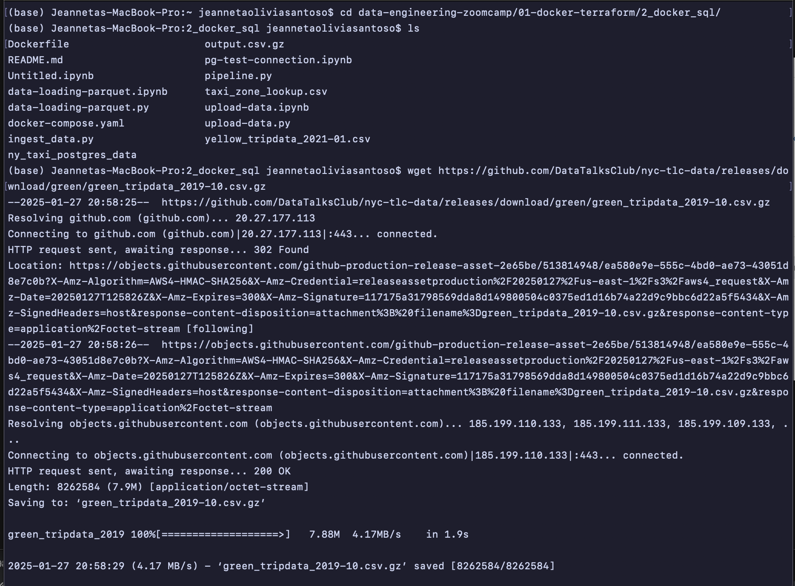
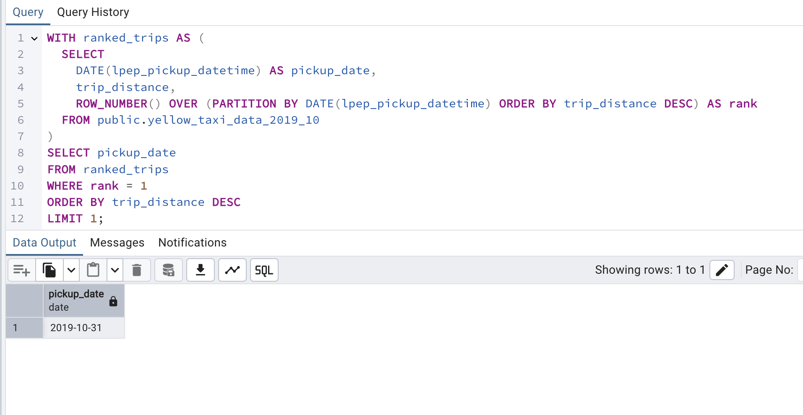
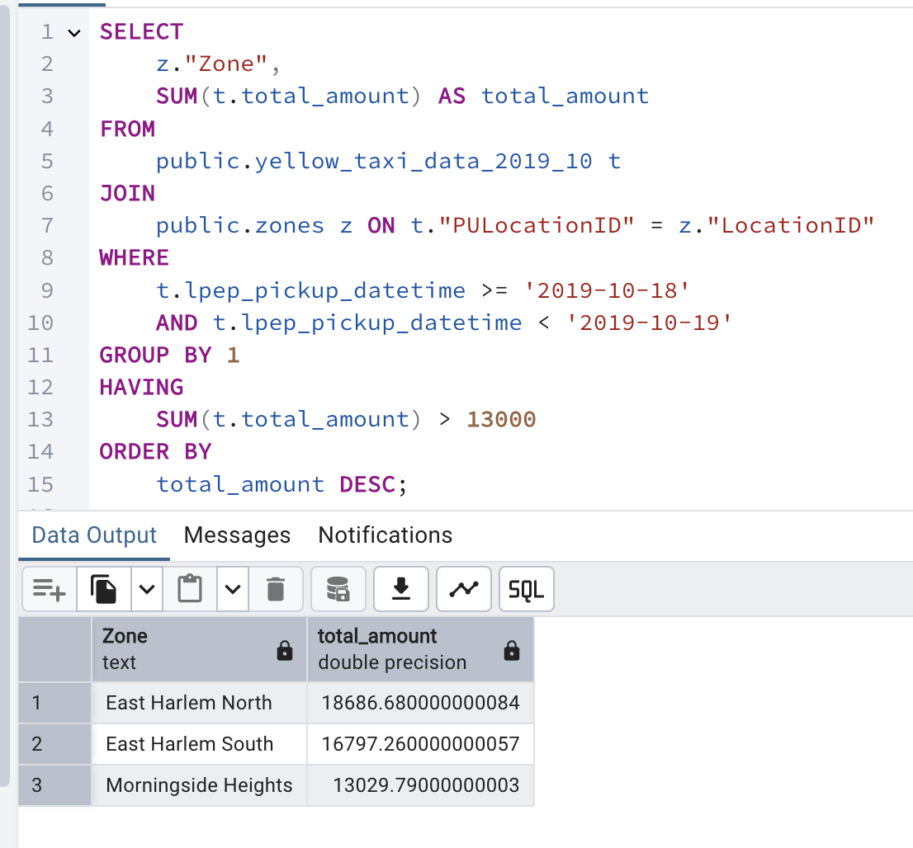
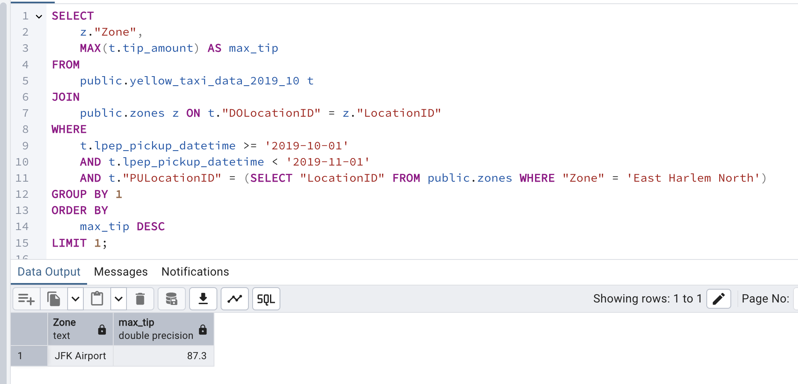

<<<<<<< HEAD
# Data Engineering Zoomcamp 2025 - HW 1

**Question 1. Understanding docker first run**

Run docker with the `python:3.12.8` image in an interactive mode, use the entrypoint `bash`.

What's the version of `pip` in the image?

Answer: 24.3.1

```python
(base) Jeannetas-MacBook-Pro:2_docker_sql jeannetaoliviasantoso$ docker run -it --entrypoint bash python:3.12.8
root@d058f3e7238d:/# pip --version
pip 24.3.1 from /usr/local/lib/python3.12/site-packages/pip (python 3.12)
root@d058f3e7238d:/# 
```

**Question 2. Understanding Docker networking and docker-compose**

Given the following `docker-compose.yaml`, what is the `hostname` and `port` that **pgadmin** should use to connect to the postgres database?

Answer: db:5432

The correct connection string inside the Docker network is `db:5432`, where:

- `db` is the hostname (the name of the service).
- `5432` is the internal port the PostgreSQL service listens on.

**Prepare Postgres**

download the dataset green taxi trips from October 2019:



ingest to database:
- [ingest_green_tripdata_2019](notebooks/ingest_green_tripdata_2019.ipynb)
- [ingest_taxi_zone_lookup](notebooks/ingest_taxi_zone_lookup.ipynb)

**Question 3. Trip Segmentation Count**

During the period of October 1st 2019 (inclusive) and November 1st 2019 (exclusive), how many trips, **respectively**, happened:

1. Up to 1 mile
2. In between 1 (exclusive) and 3 miles (inclusive),
3. In between 3 (exclusive) and 7 miles (inclusive),
4. In between 7 (exclusive) and 10 miles (inclusive),
5. Over 10 miles

Answer:  104,838; 199,013; 109,645; 27,688; 35,202

But, I got this results
104830	198995	109642	27686	35201
it is very close to the correct results, but the small discrepancies in the counts could be due to Data Type Precision.

```python
SELECT
    COUNT(CASE WHEN trip_distance <= 1. THEN 1 END) AS "Up to 1 mile",
    COUNT(CASE WHEN trip_distance > 1 AND trip_distance <= 3 THEN 1 END) AS "Between 1 and 3 miles",
    COUNT(CASE WHEN trip_distance > 3 AND trip_distance <= 7 THEN 1 END) AS "Between 3 and 7 miles",
    COUNT(CASE WHEN trip_distance > 7 AND trip_distance <= 10 THEN 1 END) AS "Between 7 and 10 miles",
    COUNT(CASE WHEN trip_distance > 10 THEN 1 END) AS "Over 10 miles"
FROM public.yellow_taxi_data_2019_10
WHERE lpep_pickup_datetime >= '2019-10-01'
  AND lpep_pickup_datetime < '2019-11-01'
  AND trip_distance IS NOT NULL
  AND lpep_pickup_datetime IS NOT NULL;

```


**Question 4. Longest trip for each day**

Which was the pick up day with the longest trip distance? Use the pick up time for your calculations.

Tip: For every day, we only care about one single trip with the longest distance.

Answer:  2019-10-31

```python
WITH ranked_trips AS (
  SELECT
    DATE(lpep_pickup_datetime) AS pickup_date,
    trip_distance,
    ROW_NUMBER() OVER (PARTITION BY DATE(lpep_pickup_datetime) ORDER BY trip_distance DESC) AS rank
  FROM public.yellow_taxi_data_2019_10
)
SELECT pickup_date
FROM ranked_trips
WHERE rank = 1
ORDER BY trip_distance DESC
LIMIT 1;

```




**Question 5. Three biggest pickup zones**

Which were the top pickup locations with over 13,000 in `total_amount` (across all trips) for 2019-10-18?

Consider only `lpep_pickup_datetime` when filtering by date.

Answer:  East Harlem North, East Harlem South, Morningside Heights

```python
SELECT 
    z."Zone", 
    SUM(t.total_amount) AS total_amount
FROM 
    public.yellow_taxi_data_2019_10 t
JOIN 
    public.zones z ON t."PULocationID" = z."LocationID"
WHERE 
    t.lpep_pickup_datetime >= '2019-10-18' 
    AND t.lpep_pickup_datetime < '2019-10-19'
GROUP BY 1
HAVING 
    SUM(t.total_amount) > 13000
ORDER BY 
    total_amount DESC;

```




**Question 6. Largest tip**

For the passengers picked up in October 2019 in the zone named "East Harlem North" which was the drop off zone that had the largest tip?

Note: it's `tip` , not `trip`

We need the name of the zone, not the ID.

Answer:  JFK Airport

```python
SELECT 
    z."Zone", 
    MAX(t.tip_amount) AS max_tip
FROM 
    public.yellow_taxi_data_2019_10 t
JOIN 
    public.zones z ON t."DOLocationID" = z."LocationID"
WHERE 
    t.lpep_pickup_datetime >= '2019-10-01' 
    AND t.lpep_pickup_datetime < '2019-11-01'
    AND t."PULocationID" = (SELECT "LocationID" FROM public.zones WHERE "Zone" = 'East Harlem North')
GROUP BY 1
ORDER BY 
    max_tip DESC
LIMIT 1;

```




**Question 7. Terraform Workflow**

Which of the following sequences, **respectively**, describes the workflow for:

1. Downloading the provider plugins and setting up backend,
2. Generating proposed changes and auto-executing the plan
3. Remove all resources managed by terraform`

Answer:  terraform init, terraform apply -auto-approve, terraform destroy
=======